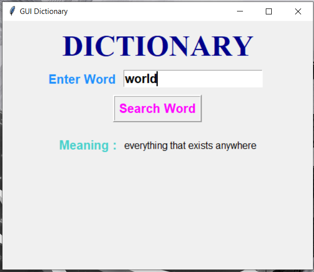
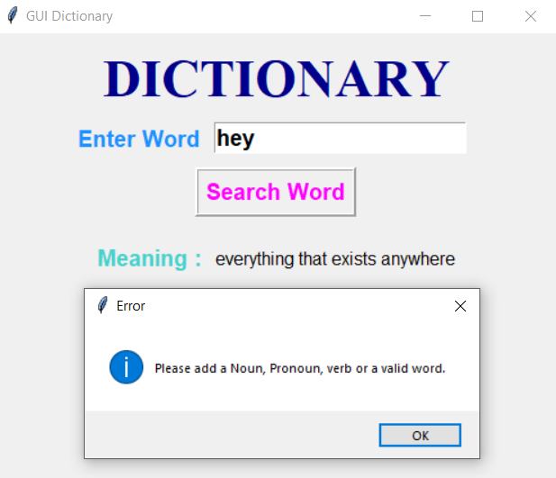

# Dictionary GUI
This script lets the user search for the meaning of words like a dictionary.

## Setup instructions
In order to run this script, you need to have Python and pip installed on your system. After you're done installing Python and pip, run the following command from your terminal to install the requirements for the project.
```
pip install PyDictionary
```

After satisfying all the requirements for the project, Open the terminal in the project folder and run
```
python GUI_Dictionary.py
```
or
```
python3 GUI_Dictionary.py
```
depending upon the python version. Make sure that you are running the command from the same virtual environment in which the required modules are installed.

# Introducing to Interface

<br>
<br>
