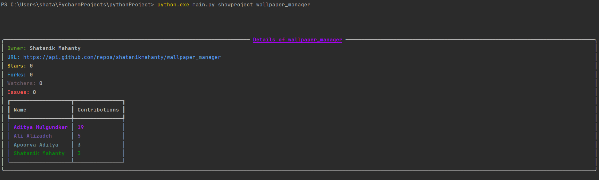

# GitHub CLI With Python
This is a GitHub CLI utility using python. It aims to simplify daily github stats through powerful CLI ui

## How to install?
1) Open CMD (Command Prompt)
2) Run python githubCLI.py --help to see all available commands

## Available Commands
1) `python.exe main.py showall` - See all available projects for your account
2) `python.exe main.py showproject project` - See stats for your project. Replace project in command with project name
3) More commands coming soon!

## Requirements?
-[ ] Replace `ADD_YOUR_OWN` in GitHub initialization using access token from GitHub
-[ ] Install typer using `pip install typer[all]`
-[ ] Install pygithub using `pip install pygithub`

## Live action preview:

Hope you enjoy it! Made with ❤️ by Shatanik Mahanty
