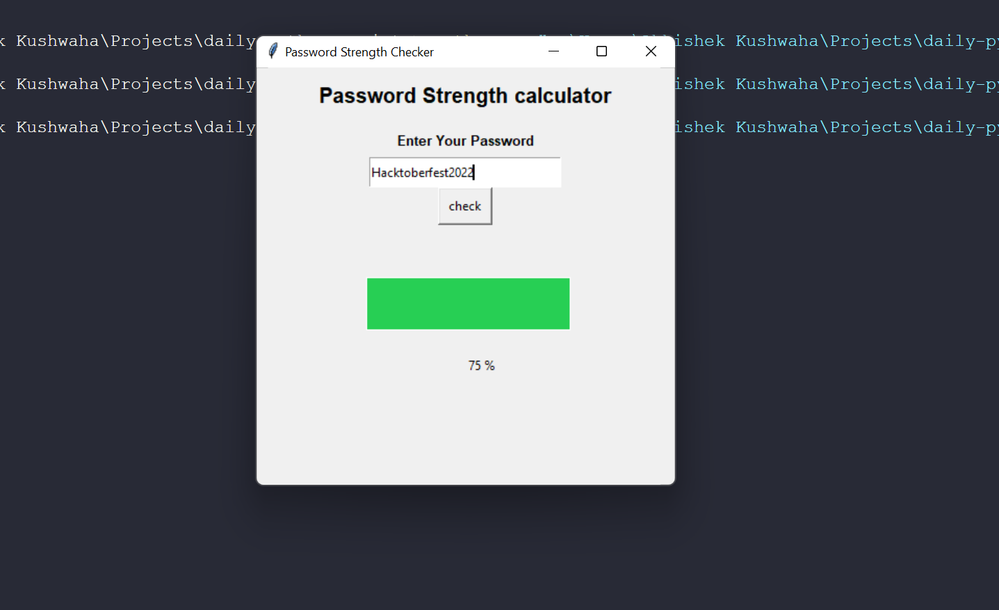

# Password Strength Checker

This script checks the strength of a password. It uses the Password Strength Package to check the strength of the password.


## ```How to use```

1. Install the Password Strength Package using the following command:

    `pip install password-strength`

    Official Documentation: https://pypi.org/project/password-strength/

2. Run the script and enter the password to check the strength of the password.

## ```Output```

The output will be a number percentage between 0 and 1. The higher the number, the stronger the password.



## ```Test Cases```

The following test cases were used to test the script:

<div align="center">

| Password | Strength |
| --- | --- |
| milkywaygalaxy | 56% |
| iamacoderfromkolkata@123 | 91% |
| asdfghjkl | 32% |
| Hacktoberfest2022 | 75% |

</div>

## Author
Name: [Abhishek Kushwaha](https://github.com/Abbhiishek)
