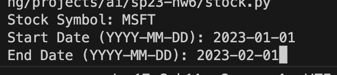
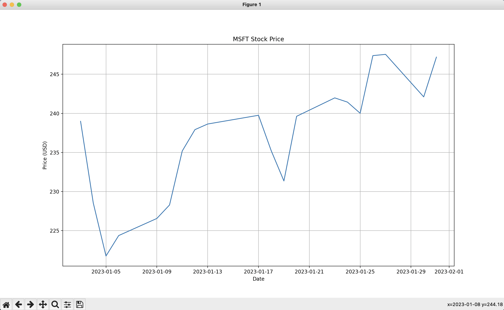

# Stock Visualizer

## About
A stock visualizer, that uses the Yahoo Finance library to create a customizable graph for the user to see. 
It will ask the user for input, specifically for the stock symbol, and the start and end dates in the form (YYYY-MM-DD).
Then, it will output a graph with those specifications.
### Input Queried from User

### Output Graph Generated

