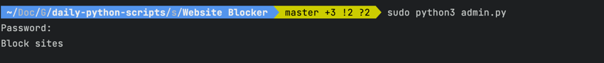
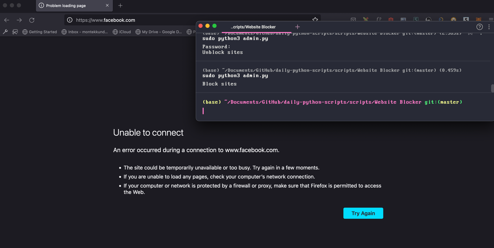
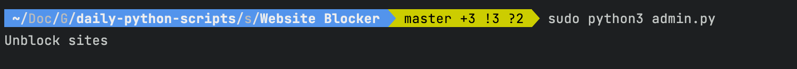
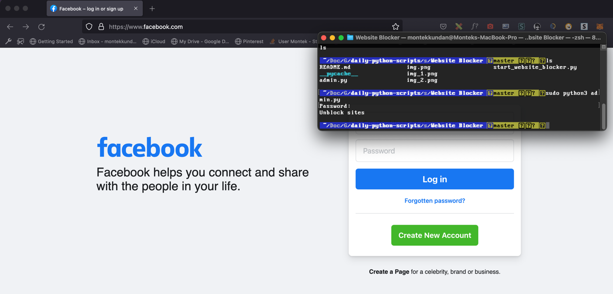

### About

A Python3 script to block certain websites.

### Setup

* Install Python3 from [here](https://python.org).
* Open cmd/terminal
* Navigate inside the ```scripts\Website Blocker``` directory.
* Run using Python
  ```bash
  sudo python admin.py
  ```
Note: Add your end time in the `admin.py` file. 

Blocking:



Unblocking:

