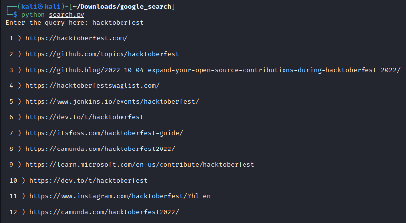

# Google Search in Python

This script prints the query relevant links scraped from Google search

## Requirements

- Python Interpreter and python package mentioned in requiremnts file

## How to run the script

1. Install the required dependencies by running `pip install -r requirements.txt` command in the terminal.
2. Run the scipt by `python search.py` command.
3. Enter the query needed to searched in Google.
4. The script prints the relevant links.

## Screenshot

