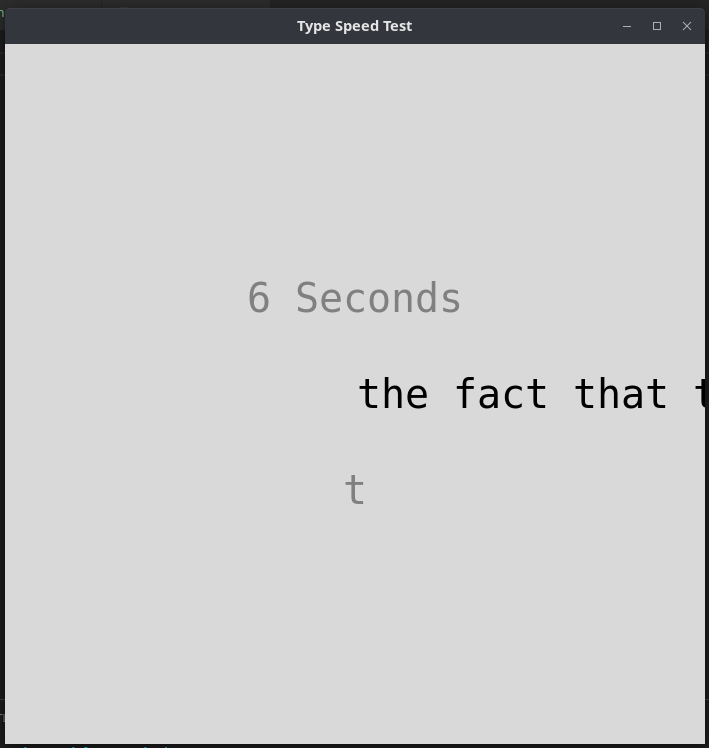
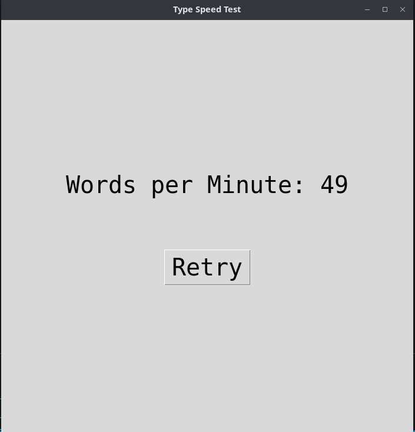

## Typing Test Application proudly made with Python

> A program with which is made with Python, with the interface possible by Tkinter, a default GUI libray in python.

It uses a timer, which goes from 0 to 60, after the 60 hits you can see your word per mintue speed.
